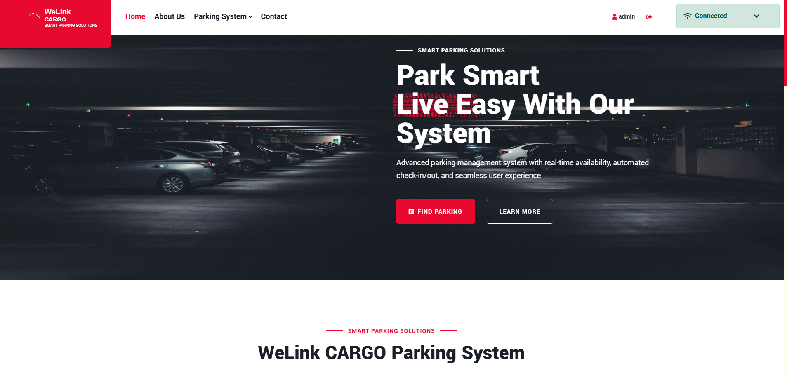
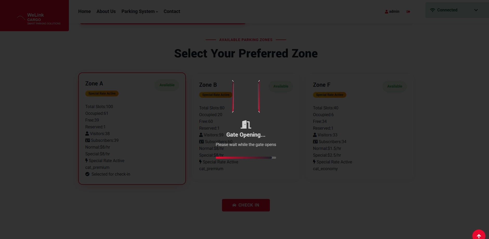
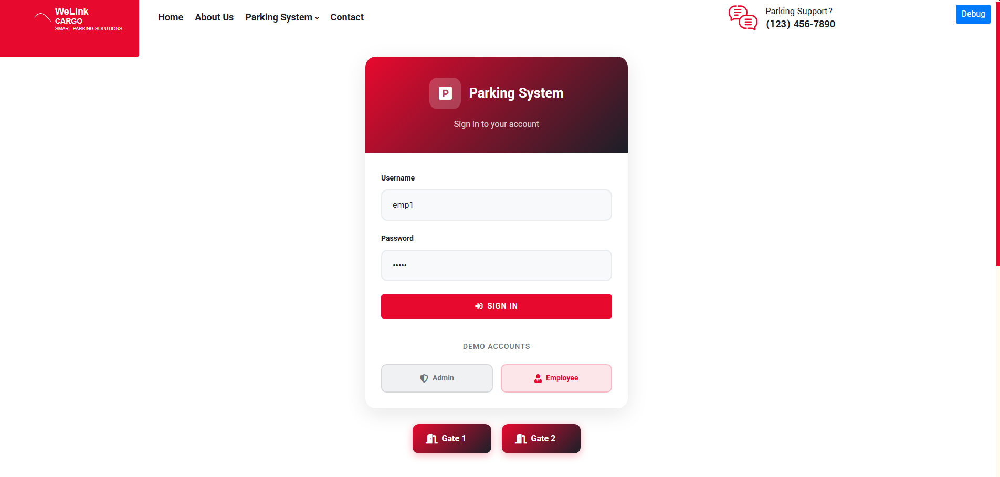
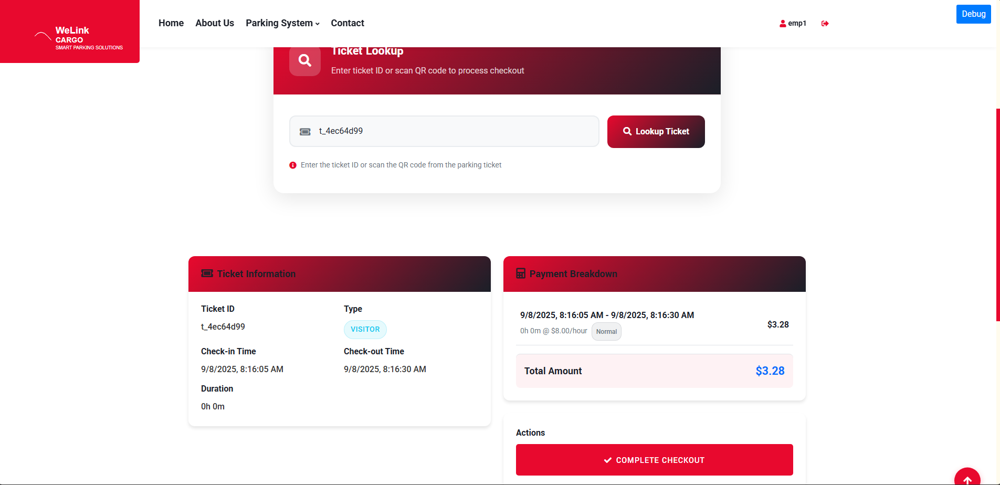
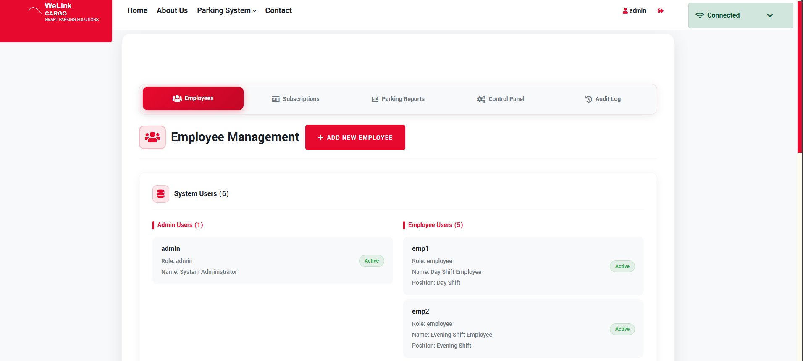
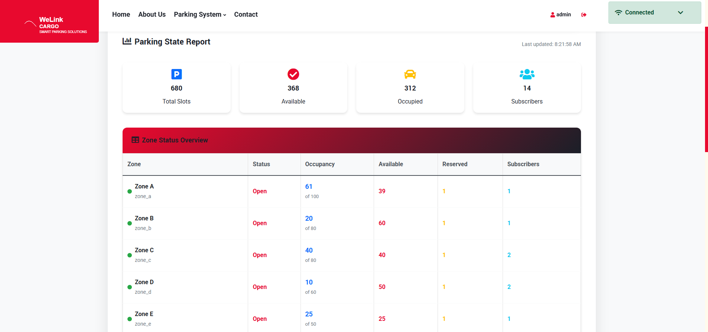
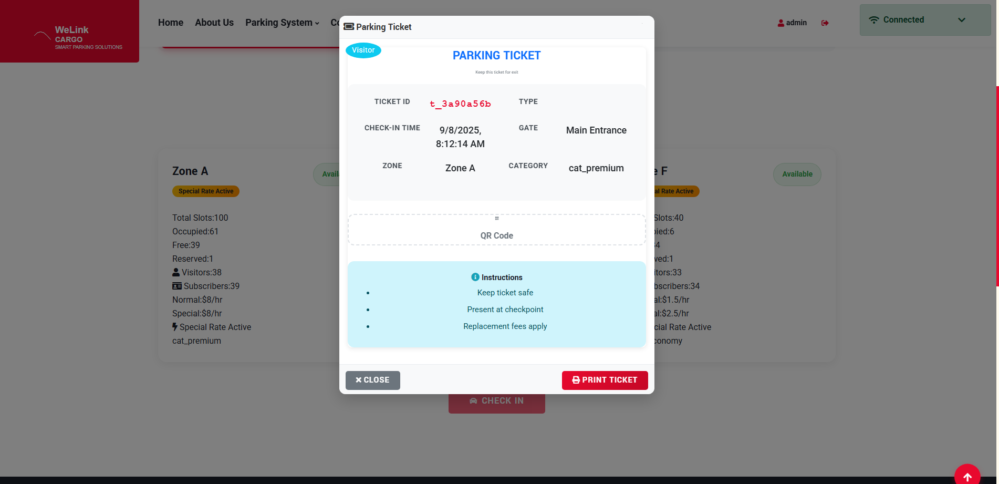
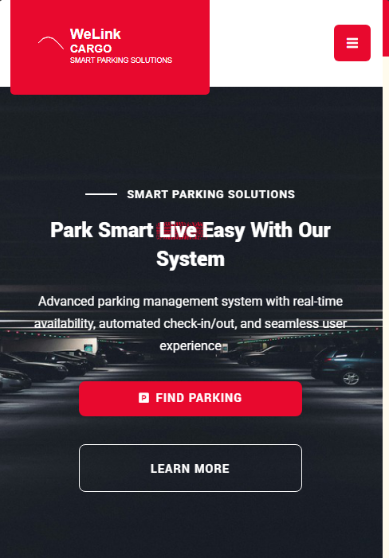
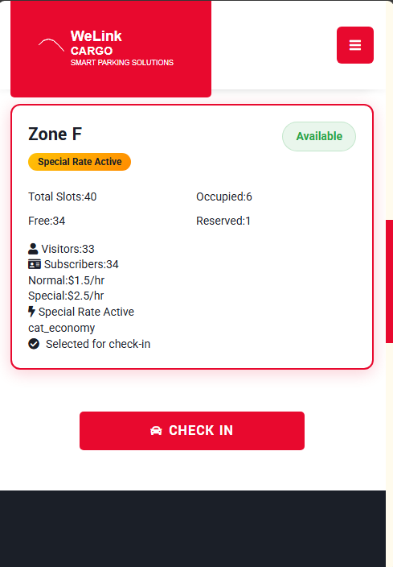
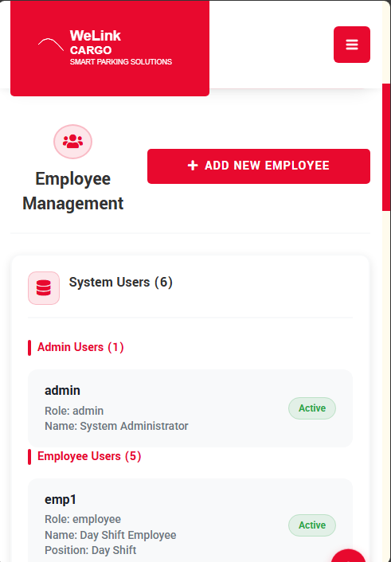

# 🅿️ Parking Reservation System

A comprehensive, production-ready parking reservation system built with React, Node.js, and real-time WebSocket integration.

## 🌟 Features

### 🚪 Gate Management
- **Multi-gate Support**: 5 different entrance gates
- **Real-time Zone Display**: Live availability updates
- **Visitor Check-in**: Quick and easy visitor parking
- **Subscriber Check-in**: Subscription-based parking with verification
- **Printable Tickets**: Professional ticket generation with print functionality

### 🏢 Employee Checkpoint
- **Secure Authentication**: Employee login system
- **Ticket Processing**: QR code scanning simulation
- **Payment Calculation**: Automatic fee calculation with breakdown
- **Subscriber Conversion**: Convert subscriber tickets to visitor when needed
- **Real-time Updates**: Live zone occupancy updates

### 👨‍💼 Admin Dashboard
- **Comprehensive Reports**: Real-time parking state monitoring
- **Zone Management**: Open/close zones, update rates
- **Category Control**: Manage parking categories and pricing
- **Rush Hour Management**: Configure peak time pricing
- **Vacation Periods**: Set special pricing periods
- **Audit Logging**: Complete admin action tracking
- **User Management**: Employee account administration

### 🔄 Real-time Features
- **WebSocket Integration**: Live updates across all clients
- **Connection Monitoring**: Health status and reconnection logic
- **Admin Notifications**: Real-time admin action broadcasting
- **Zone Updates**: Instant availability changes

## 🛠️ Tech Stack

### Frontend
- **React 18** - Modern React with hooks and concurrent features
- **React Router** - Client-side routing
- **React Query** - Server state management and caching
- **Zustand** - Lightweight state management
- **Bootstrap 5** - Responsive UI framework
- **SCSS** - Enhanced styling capabilities
- **WebSocket** - Real-time communication

### Backend
- **Node.js** - JavaScript runtime
- **Express.js** - Web framework
- **WebSocket** - Real-time bidirectional communication
- **JWT** - Secure authentication

### Testing
- **Jest** - Testing framework
- **React Testing Library** - Component testing
- **MSW** - API mocking
- **jest-axe** - Accessibility testing
- **User Event** - User interaction testing

## 📸 Screenshots & Demo

### 🏠 Homepage & Navigation

*Modern homepage with hero section and navigation*

### 🚪 Gate Operations

*Visitor and subscriber check-in interface*

### 🏢 Employee Checkpoint

*Employee authentication and access*


*Ticket lookup and payment processing*

### 👨‍💼 Admin Dashboard

*Secure admin authentication*


*Comprehensive administrative controls*


*Real-time parking reports and analytics*

### 🎫 Ticket System

*Professional ticket creation and printing*

### 📱 Mobile Responsive Design

*Mobile-optimized homepage*


*Touch-friendly gate interface*


*Responsive admin panel*

## 🚀 Quick Start

### Prerequisites
- Node.js (v16 or higher)
- npm or yarn
- Git

### Installation

1. **Clone the repository**
   ```bash
   git clone <repository-url>
   cd parking-reservations-system
   ```

2. **Setup Backend**
   ```bash
   cd parking-back
   npm install
   npm start
   ```
   Backend runs on `http://localhost:3000`

3. **Setup Frontend**
   ```bash
   cd parking-front
   npm install
   npm start
   ```
   Frontend runs on `http://localhost:3001`

## 📱 System Access

### Public Access (No Login Required)
- **Gate 1**: http://localhost:3001/gate/gate_1
- **Gate 2**: http://localhost:3001/gate/gate_2
- **Gate 3**: http://localhost:3001/gate/gate_3
- **Gate 4**: http://localhost:3001/gate/gate_4
- **Gate 5**: http://localhost:3001/gate/gate_5

### Employee Access
- **Checkpoint**: http://localhost:3001/checkpoint
- **Login**: http://localhost:3001/login

### Admin Access
- **Admin Dashboard**: http://localhost:3001/admin
- **Login**: http://localhost:3001/login

## 🔐 Demo Accounts

### Admin Account
- **Username**: `admin`
- **Password**: `adminpass`
- **Access**: Full system administration

### Employee Account
- **Username**: `emp1`
- **Password**: `pass1`
- **Access**: Checkpoint operations

## 🧪 Testing

### Running Tests
```bash
# Run all tests
npm test

# Run with coverage
npm test -- --coverage

# Run specific test suites
npm test -- --testPathPattern=websocket
npm test -- --testPathPattern=accessibility
npm test -- --testPathPattern=performance
```

### Test Coverage
- **WebSocket Integration**: Real-time functionality testing
- **Error Scenarios**: Comprehensive error handling
- **End-to-End Flows**: Complete user journey testing
- **API Integration**: Backend communication testing
- **Accessibility**: WCAG compliance testing
- **Performance**: Rendering and memory performance

## 📊 System Architecture

```
┌─────────────────┐    ┌─────────────────┐    ┌─────────────────┐
│   Frontend      │    │   Backend       │    │   WebSocket     │
│   (React)       │◄──►│   (Node.js)     │◄──►│   (Real-time)   │
│                 │    │                 │    │                 │
│ • Gate Pages    │    │ • REST API      │    │ • Zone Updates  │
│ • Checkpoint    │    │ • Authentication│    │ • Admin Actions │
│ • Admin Panel   │    │ • Business Logic│    │ • Notifications │
│ • Real-time UI  │    │ • Data Storage  │    │ • Health Monitor│
└─────────────────┘    └─────────────────┘    └─────────────────┘
```

## 🔧 Development

### Project Structure
```
parking-reservations-system/
├── parking-back/                 # Backend API server
│   ├── server.js                # Main server file
│   ├── seed.json                # Initial data
│   ├── package.json             # Backend dependencies
│   └── tests/                   # Backend tests
├── parking-front/               # React frontend
│   ├── src/
│   │   ├── components/          # React components
│   │   │   └── parking/         # Parking-specific components
│   │   ├── pages/               # Main application pages
│   │   ├── services/            # API and WebSocket services
│   │   ├── store/               # State management
│   │   ├── utils/               # Utility functions
│   │   └── __tests__/           # Comprehensive test suite
│   │       ├── websocket/       # WebSocket integration tests
│   │       ├── error-scenarios/ # Error handling tests
│   │       ├── integration/     # End-to-end tests
│   │       ├── api/             # API integration tests
│   │       ├── accessibility/   # Accessibility tests
│   │       └── performance/     # Performance tests
│   ├── public/                  # Static assets
│   └── package.json             # Frontend dependencies
└── README.md                    # This file
```

### Key Components

#### Frontend Components
- **GatePage**: Visitor and subscriber check-in interface
- **CheckpointPage**: Employee checkout processing
- **AdminPage**: Administrative dashboard
- **TicketModal**: Printable parking tickets
- **WebSocketStatus**: Real-time connection monitoring
- **AdminAuditLog**: Admin action tracking

#### Backend Services
- **REST API**: Complete CRUD operations
- **WebSocket Server**: Real-time communication
- **Authentication**: JWT-based security
- **Business Logic**: Parking calculations and validations

## 🎯 Key Features Demonstrated

### ✅ Production-Ready Quality
- **Error Boundaries**: Graceful error handling
- **Loading States**: Professional user feedback
- **Toast Notifications**: Custom notification system
- **Responsive Design**: Mobile-friendly interface
- **Accessibility**: WCAG compliant
- **Performance**: Optimized rendering and memory usage

### ✅ Real-time Capabilities
- **Live Updates**: Zone availability changes
- **Admin Notifications**: Real-time action broadcasting
- **Connection Health**: WebSocket monitoring
- **Reconnection Logic**: Automatic recovery

### ✅ Comprehensive Testing
- **Unit Tests**: Component-level testing
- **Integration Tests**: API and WebSocket testing
- **End-to-End Tests**: Complete user flows
- **Accessibility Tests**: WCAG compliance
- **Performance Tests**: Rendering and memory benchmarks

## 🚀 Deployment

### Backend Deployment
1. Set `NODE_ENV=production`
2. Configure production database
3. Set up JWT secrets
4. Configure CORS for production domain

### Frontend Deployment
1. Run `npm run build`
2. Deploy `build/` folder to web server
3. Configure environment variables

## 📈 Performance Metrics

- **Initial Load**: < 2 seconds
- **Component Rendering**: < 100ms
- **API Response**: < 200ms
- **WebSocket Updates**: < 50ms
- **Memory Usage**: Optimized with proper cleanup

## 🔒 Security Features

- **JWT Authentication**: Secure token-based auth
- **Input Validation**: Client and server-side validation
- **CORS Configuration**: Proper cross-origin setup
- **Error Handling**: No sensitive data exposure
- **XSS Protection**: Sanitized inputs

## 📱 Browser Support

- **Chrome**: 90+
- **Firefox**: 88+
- **Safari**: 14+
- **Edge**: 90+

## 🤝 Contributing

1. Fork the repository
2. Create a feature branch
3. Make your changes
4. Add tests for new functionality
5. Ensure all tests pass
6. Submit a pull request

## 📄 License

This project is licensed under the MIT License.

## 📸 Taking Screenshots

### Quick Screenshot Guide
1. **Windows**: `Windows + Shift + S` (Snipping Tool)
2. **Mac**: `Cmd + Shift + 4` (Screenshot tool)
3. **Browser**: Right-click → "Inspect" → Device toolbar for mobile screenshots

### Screenshot Checklist
Take screenshots of these key pages:

#### 🏠 Homepage & Navigation
- [ ] Homepage hero section
- [ ] Navigation menu
- [ ] Footer section

#### 🚪 Gate Operations  
- [ ] Gate 1 check-in page
- [ ] Zone selection interface
- [ ] Ticket generation modal

#### 🏢 Employee Checkpoint
- [ ] Checkpoint login page
- [ ] Ticket lookup interface
- [ ] Payment processing screen

#### 👨‍💼 Admin Dashboard
- [ ] Admin login page
- [ ] Main dashboard overview
- [ ] Reports section
- [ ] Rate configuration modal

#### 📱 Mobile Views
- [ ] Mobile homepage
- [ ] Mobile gate interface
- [ ] Mobile admin panel

### File Naming Convention
Save screenshots as:
```
docs/screenshots/
├── homepage.png
├── gate-checkin.png
├── checkpoint-login.png
├── checkpoint-process.png
├── admin-login.png
├── admin-dashboard.png
├── admin-reports.png
├── ticket-generation.png
├── mobile-homepage.png
├── mobile-gate.png
└── mobile-admin.png
```

### Screenshot Tips
- **Use high resolution** (1920x1080 or higher)
- **Clean browser** with no extensions visible
- **Consistent browser zoom** (100%)
- **Good contrast** and readable text
- **PNG format** for best quality

## 🆘 Support

For issues or questions:
1. Check the console logs
2. Verify all dependencies are installed
3. Ensure both servers are running
4. Check network connectivity


---

