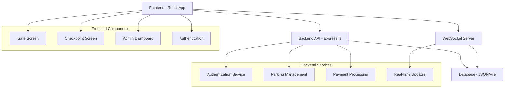

# 🅿️ Smart Parking Management System

A comprehensive full-stack parking management solution built with React.js and Node.js, featuring real-time updates, role-based access control, and modern UI/UX design.

   

## 🚀 Live Demo

- **Frontend**: [View Live Demo](https://your-demo-url.com) *(Coming Soon)*
- **Backend API**: [API Documentation](https://your-api-docs.com) *(Coming Soon)*

## 📋 Table of Contents

- [Features](#-features)
- [Tech Stack](#-tech-stack)
- [Architecture](#-architecture)
- [Quick Start](#-quick-start)
- [API Documentation](#-api-documentation)
- [Screenshots](#-screenshots)
- [Project Structure](#-project-structure)
- [Contributing](#-contributing)
- [License](#-license)

## ✨ Features

### 🎯 Core Functionality
- **Gate Management**: Real-time check-in for visitors and subscribers
- **Checkpoint System**: Employee checkout with payment calculation
- **Admin Dashboard**: Comprehensive zone and rate management
- **Real-time Updates**: WebSocket integration for live status updates
- **QR Code Integration**: Ticket scanning and validation
- **Subscription Management**: Vehicle registration and verification

### 🔐 Security & Access Control
- **Role-based Authentication**: Admin, Employee, and Public access levels
- **JWT Token Security**: Secure session management
- **Form Validation**: Client and server-side validation with Yup
- **Protected Routes**: Secure admin and employee areas

### 📱 User Experience
- **Responsive Design**: Mobile-first approach with Bootstrap 5
- **Modern UI/UX**: Clean, professional interface
- **Toast Notifications**: User-friendly feedback system
- **Loading States**: Smooth user interactions
- **Error Handling**: Graceful error management

### 🛠️ Technical Features
- **State Management**: Zustand for global state
- **Data Fetching**: React Query for efficient API calls
- **Real-time Communication**: WebSocket integration
- **Form Management**: React Hook Form with validation
- **Code Quality**: ESLint, Prettier, and comprehensive testing

## 🛠️ Tech Stack

### Frontend
- **React 18** - Modern React with hooks and functional components
- **React Router DOM** - Client-side routing
- **React Query** - Data fetching and caching
- **Zustand** - Lightweight state management
- **React Hook Form** - Form handling and validation
- **Yup** - Schema validation
- **Axios** - HTTP client
- **Bootstrap 5** - CSS framework
- **SCSS** - Advanced styling
- **react-hot-toast** - Toast notifications

### Backend
- **Node.js** - Runtime environment
- **Express.js** - Web framework
- **WebSocket** - Real-time communication
- **JWT** - Authentication tokens
- **CORS** - Cross-origin resource sharing

### Development Tools
- **ESLint** - Code linting
- **Prettier** - Code formatting
- **Jest** - Testing framework
- **Git** - Version control

## 🏗️ Architecture



## 🚀 Quick Start

### Prerequisites
- Node.js (v16 or higher)
- npm or yarn
- Git

### Installation

1. **Clone the repository**
   ```bash
   git clone https://github.com/ahmadmusta22/parking-management-frontend.git
   cd parking-management-frontend
   ```

2. **Install dependencies**
   ```bash
   # Install backend dependencies
   cd parking-back
   npm install
   
   # Install frontend dependencies
   cd ../parking-front
   npm install
   ```

3. **Start the backend server**
   ```bash
   cd parking-back
   npm start
   ```
   Backend will run on `http://localhost:3000`

4. **Start the frontend development server**
   ```bash
   cd parking-front
   npm start
   ```
   Frontend will run on `http://localhost:3001`

5. **Access the application**
   - Frontend: http://localhost:3001
   - Backend API: http://localhost:3000/api/v1

### Demo Accounts

| Role | Username | Password | Access Level |
|------|----------|----------|--------------|
| Admin | `admin` | `adminpass` | Full system control |
| Employee | `emp1` | `pass1` | Checkout operations |

## 📚 API Documentation

### Authentication Endpoints
- `POST /auth/login` - User authentication
- `POST /auth/logout` - User logout

### Parking Management
- `GET /master/gates` - Get all gates
- `GET /master/zones` - Get all parking zones
- `GET /master/categories` - Get pricing categories
- `POST /tickets/checkin` - Create parking ticket
- `POST /tickets/checkout` - Process checkout

### Admin Operations
- `GET /admin/reports` - Get parking reports
- `PUT /admin/zones/:id` - Update zone status
- `PUT /admin/rates/:id` - Update pricing rates

### WebSocket Events
- `zone-update` - Real-time zone status updates
- `admin-update` - Admin action notifications

## 📸 Screenshots

### Gate Screen

*Real-time zone availability and check-in interface*

### Admin Dashboard

*Comprehensive management interface with live reports*

### Checkpoint Screen

*Employee checkout with payment calculation*

## 📁 Project Structure

```
parking-management-frontend/
├── parking-back/                 # Backend API Server
│   ├── server.js                # Main server file
│   ├── package.json             # Backend dependencies
│   ├── seed.json                # Sample data
│   └── tests/                   # Backend tests
├── parking-front/               # React Frontend
│   ├── public/                  # Static assets
│   ├── src/
│   │   ├── components/          # Reusable components
│   │   │   └── parking/         # Parking-specific components
│   │   ├── pages/               # Page components
│   │   ├── services/            # API and WebSocket services
│   │   ├── store/               # State management
│   │   ├── hooks/               # Custom React hooks
│   │   └── utils/               # Utility functions
│   ├── package.json             # Frontend dependencies
│   └── README.md                # Frontend documentation
├── .gitignore                   # Git ignore rules
└── README.md                    # This file
```

## 🧪 Testing

### Frontend Tests
```bash
cd parking-front
npm test
```

### Backend Tests
```bash
cd parking-back
npm test
```

### Integration Tests
```bash
# Run full test suite
npm run test:all
```

## 🚀 Deployment

### Frontend Deployment (Netlify/Vercel)
```bash
cd parking-front
npm run build
# Deploy the 'build' folder
```

### Backend Deployment (Heroku/Railway)
```bash
cd parking-back
# Configure environment variables
# Deploy to your preferred platform
```

## 🤝 Contributing

1. Fork the repository
2. Create a feature branch (`git checkout -b feature/amazing-feature`)
3. Commit your changes (`git commit -m 'Add some amazing feature'`)
4. Push to the branch (`git push origin feature/amazing-feature`)
5. Open a Pull Request

## 📝 License

This project is licensed under the MIT License - see the [LICENSE](LICENSE) file for details.

## 👨‍💻 Author

**Ahmad Mustafa**
- GitHub: [@ahmadmusta22](https://github.com/ahmadmusta22)
- LinkedIn: [Your LinkedIn Profile]
- Email: [your.email@example.com]

## 🙏 Acknowledgments

- React team for the amazing framework
- Express.js community for the robust backend framework
- Bootstrap team for the responsive CSS framework
- All open-source contributors who made this project possible

---

⭐ **Star this repository if you found it helpful!**

🔗 **Connect with me on [LinkedIn](https://linkedin.com/in/your-profile) for opportunities and collaborations.**
